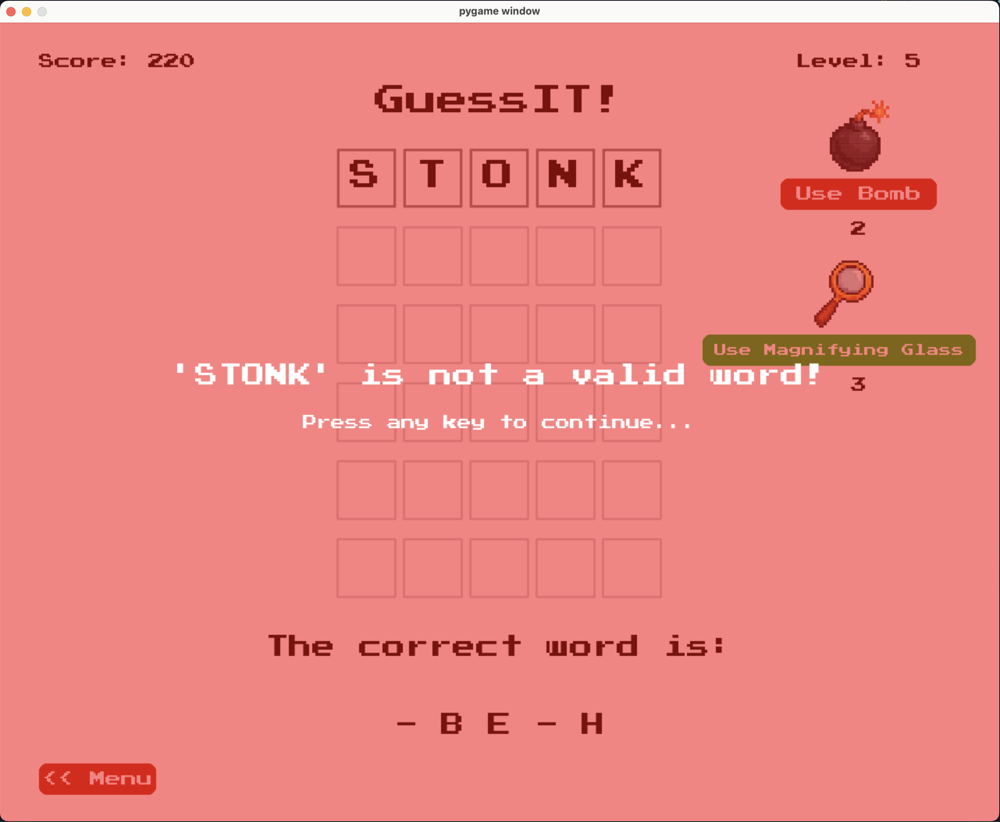
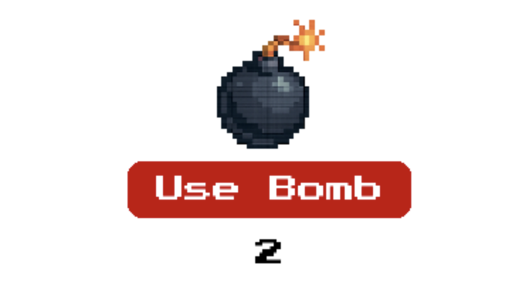
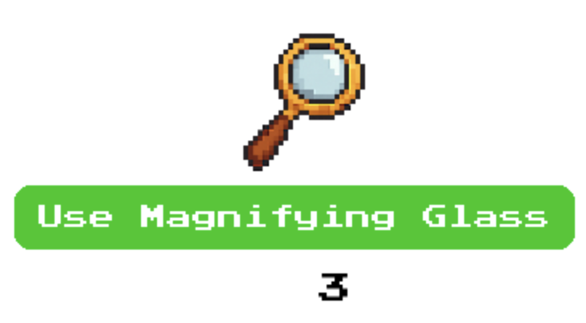
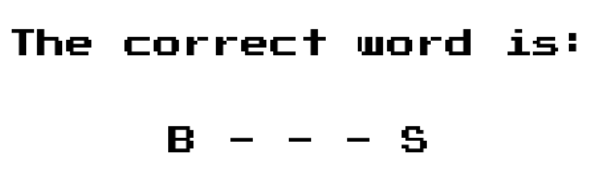
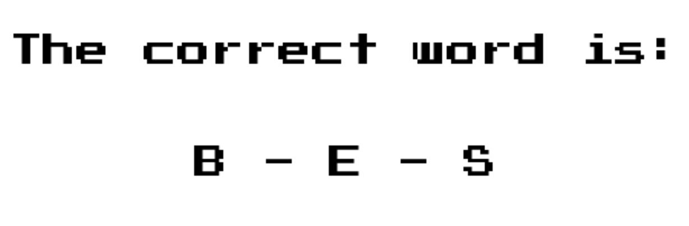
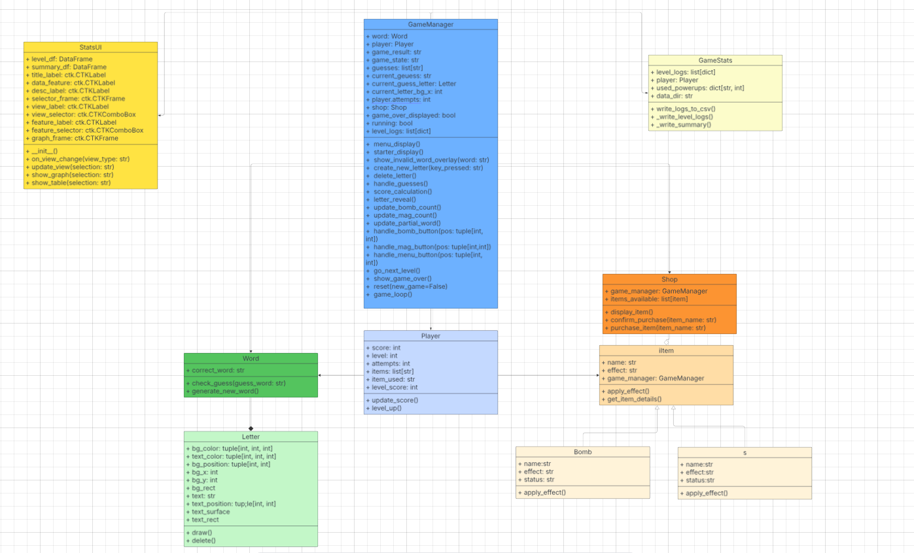

# GuessIT-Game
This project is a level-based word-guessing game where players have six attempts to guess a randomly selected valid word in each round. Early levels provide hints by revealing some letters, but as the game progresses to increasing the difficulty fewer clues are given. Players earn points based on how quickly they guess correctly, the fewer attempts the higher scores they get. These points can be spent on power-ups at certain stages of the game.
## Game Concept
The game objective is to guess a hidden valid 5-letter word within six attempts based on the game rules

## Game Rules:
Each letter will have it own box to store like the picture provided

  
**If a guessed letter is not in the word, the box turns black.**

 
**If a guessed letter is in the word but in the wrong position, the box turns yellow.**

 
**If a guessed letter is in the correct position, the box turns green.**

 
**If the word is invalid (not in the word list that the game provided)**

### Items:
 
**This item will delete the latest guesses (last row of guesses) to make player able to guess it again.**

 
**This item will reveal more letter in the correct word section**
Before: 
 

After: 
 

Players will start with some letters revealed, which will be fewer as they level up. They can advance to the next level by scoring enough points for the requirement, The lower the attempt they guess the more points they get. There will be a shop at some checkpoints level that lets players buy items using earned points.

## UML Class Diagram
 